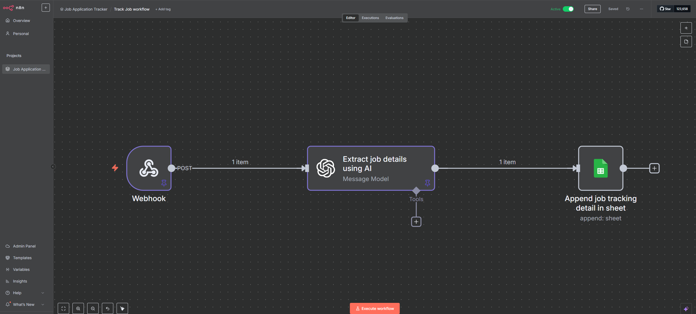
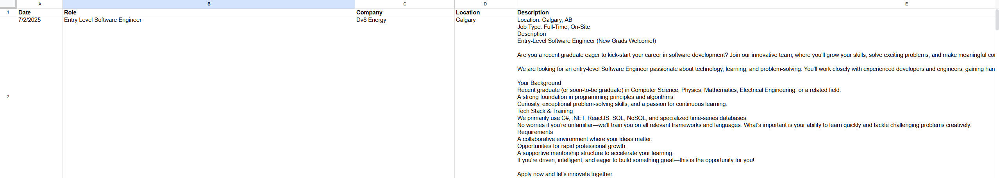

# 🧠 Job Tracker Automation

A personal automation project to track job applications using a browser bookmarklet, n8n workflow, OpenAI, and Google Sheets.

---

## 🛠️ Problem

Tracking job applications manually is tedious. Copying job titles, descriptions, and URLs into a spreadsheet every time you apply wastes time and introduces human error, especially when applying to multiple roles in a day.

---

## ✅ Solution

This automation allows you to:

1. Click a **browser bookmarklet** while on any job posting page.
2. Send the page’s **visible text** (`innerText`) to an **n8n webhook**.
3. Use **OpenAI** in the workflow to intelligently extract:
    - Job Role
    - Company Name
    - Location
    - Full Job Description
4. Append the extracted data with today’s date into a **Google Sheet**.

---

## 🔄 Workflow Diagram


---

## 🧰 Tech Stack
- **n8n**: No-code automation tool for building the workflow

- **OpenAI**: Extract job details from raw innerText

- **Google Sheets**: Store job applications

- **Bookmarklet (JavaScript)**: Trigger from browser

---

## 🚀 Setup
### 1. Set up n8n
- Install n8n locally or use n8n cloud instance (https://n8n.io/).

### 2. Create Google Sheet
- Create a new Google Sheet named "Job Applications".
- Add headers in the first row:
  - `Date`
  - `Role`
  - `Company`
  - `Location`
  - `Description`

### 3. Create OpenAI API Key
- Sign up for OpenAI and create an API key (https://auth.openai.com/create-account).

### 4. Create n8n Workflow
#### 4.1: Add a **Webhook** node to receive data from the bookmarklet (Bookmarklet setup is defined below).
- HTTP Method: `POST`

- Path: `job-tracker`

- Expected Payload:
```json
{
  "body": {
    "innerText": "Visible text from job posting page"
  }
}
```

#### 4.2: Add an **OpenAI** node to process the innerText.
- Credentials: Use your OpenAI API key
- Resource: `Text`
- Operation: `Message a Model`
- Model: `gpt-4o` (or any other model you prefer)
- Prompt:
```plaintext
Extract the following fields from this job page text:
- Role
- Company
- Location (just city, or "Remote")
- Description (verbatim, do not summarize)

Output as JSON:
{
  "Role": "...",
  "Company": "...",
  "Location": "...",
  "Description": "..."
}

Job page text:
{{ $json.body.innerText }}
```
- Expected Output:
```json
{
  "message": {
    "role": "assistant",
    "content": {
      "Role": "Software Engineer",
      "Company": "Tech Corp",
      "Location": "San Francisco",
      "Description": "Full job description here..."
    }
  }
}
```

#### 4.3: Add a **Google Sheets** node to append the extracted data.
- Credentials: Connect your Google account
- Resource: `Sheet Within Document`
- Operation: `Append Row`
- Document: Select your "Job Applications" sheet
- Sheet: Select the sheet where you want to append data
- Mapping:
  - `Date`: Use `{{ new Date().toLocaleDateString("en-US") }}`
  - `Role`: Use `{{ $json.message.content.Role }}`
  - `Company`: Use `{{ $json.message.content.Company }}`
  - `Location`: Use `{{ $json.message.content.Location }}`
  - `Description`: Use `{{ $json.message.content.Description }}`

### 5. Create Bookmarklet
- Create a new bookmark in your browser with the following code as the URL:
```javascript
javascript:(function(){
  fetch('https://your-n8n-instance.com/webhook/job-tracker', {
    method: 'POST',
    headers: {'Content-Type': 'application/json'},
    body: JSON.stringify({
      innerText: document.body.innerText
    })
  })
  .then(() => alert('✅ Sent to n8n!'))
  .catch(() => alert('❌ Failed to send. Check console for details.'));
})();
```
- Replace `https://your-n8n-instance.com/webhook/job-tracker` with your actual n8n instance URL.

### 6. Test the Workflow
- Open a job posting page in your browser.
- Click the bookmarklet you created.
- Check your n8n workflow execution logs to ensure the data was received and processed correctly.
- Verify that the data appears in your Google Sheet.
- If everything works, you can start using this automation to track your job applications!
- Example Google Sheets entry:


---

## ✨ Possible Enhancements
- Add tags like “Full-Time”, “Remote”, “Entry-Level”
- Integrate email notifications for new applications
- Add auto-summary or sentiment analysis of job posts
- Include a dashboard to visualize application status
- Add a status field to track application progress (e.g., Applied, Interviewed, Rejected)

---

## 💡 Inspiration
Inspired by the need to speed up job applications while still logging important data for follow-up.


